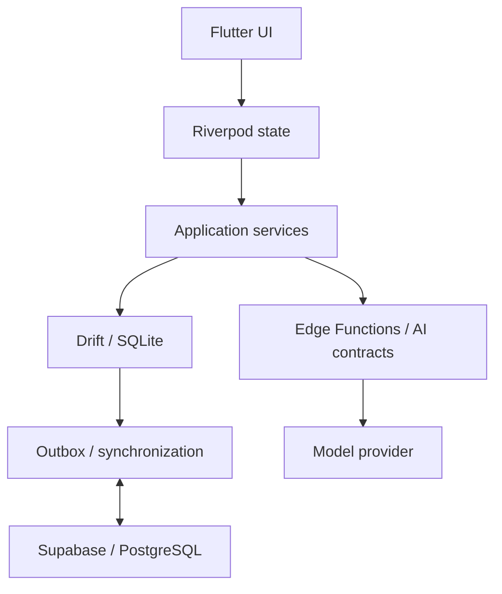

  

<h1 align="center">Level Up</h1>

  <strong>Plan your day. Do the work. Review with AI.</strong> 
  A production iOS app, independently designed, engineered, and shipped by Wassim Akkash.

  <a href="https://apps.apple.com/app/levelup-ai/id6756843363">App Store</a> &nbsp;·&nbsp;
  <a href="https://levelupself.app">Website</a> &nbsp;·&nbsp;
  <a href="#explore-the-code">Explore the code</a>

## The product

Level Up brings daily planning, training, focus sessions, and AI-assisted review into one iOS app. Its AI Judge uses recorded activity to help users reflect on their day; deterministic scoring engines own the numbers shown across the app.

I built the product from interface design through Flutter development, backend integration, testing, and App Store submission. This case study focuses on three engineering problems behind that work: **reliable AI output, streaming lifecycle, and durable offline state**.

## Explore the code

Two public repositories make these patterns inspectable, with runnable examples and regression tests.

| Example | What to look for |
| :--- | :--- |
| **[Structured-output pipeline](https://github.com/wassim991/llm-structured-output-pipeline)** TypeScript · Deno · Zod | JSON parsing, strict schema validation, one repair attempt, typed failures, and a shared deadline. |
| **[Offline sync demo](https://github.com/wassim991/flutter-offline-sync-demo)** Flutter · Drift · SQLite | Atomic local writes, a durable outbox, stable operation IDs, lost acknowledgements, and duplicate echoes. |
| **[SSE lab](https://github.com/wassim991/flutter-offline-sync-demo#sse-lab)** Included in the Flutter demo | Split UTF-8 chunks, event buffering, paced text reveal, cancellation, and completion after the queue drains. |

These are standalone demonstrations informed by Level Up. The AI provider and remote sync service are simulated; the Flutter demo uses real local SQLite persistence. Each repository documents its boundaries and how to run the tests.

## Three engineering problems

### 01 · Making AI output usable

**Failure.** Shared backend preflight logic capped structured generation at 120 tokens, leaving too little room for complete AI plans. A successful request could still return an unusable payload.

**Change.** Preserve the required generation budget or reject before calling the model. Validate plan structure at the client and server boundaries, allow one bounded repair for the daily-plan flow, and return typed failures when recovery is exhausted.

**Verification.** Regression tests cover rejected output, repair, and complete drafts. The public pipeline isolates parsing, validation, bounded repair, and cancellation so those failure paths can be inspected independently.

### 02 · Finishing a stream without dumping the text

**Failure.** A final SSE event could flush the remaining reveal queue, making text that had been streaming smoothly appear all at once.

**Change.** Separate transport completion from presentation completion. Mark the response complete only after the reveal queue drains; cancel pending work when the user leaves or cancels.

**Verification.** Burst-delivery and completion-before-reveal tests exercise the timing boundary. The public SSE lab also covers split byte sequences, malformed data, interrupted streams, and cancellation.

### 03 · Keeping local work through retries and echoes

**Failure.** A completed focus session needs to survive offline use without being counted again when a retry or realtime echo arrives.

**Change.** Persist locally with Drift, retain pending work in an outbox, and reuse stable operation IDs during synchronization. Reconcile incoming acknowledgements and echoes with existing local state.

**Verification.** Local restoration and simulated echo tests check that completion is represented once. The public sync demo adds a reproducible lost-acknowledgement scenario and a disk-backed restart test.

## System overview

The Flutter client separates UI, state, services, and persistence. This diagram highlights the data and AI paths; billing and optional HealthKit access are separate integrations.

Three boundaries guide the implementation:

- **Persist before syncing.** Local work remains available while remote synchronization catches up.
- **Validate before using AI output.** Generated content must satisfy the application contract before it becomes an actionable plan.
- **Keep one owner for scores.** Deterministic engines calculate values; AI supplies review language.

## Stack and delivery

| Area | Technologies and responsibilities |
| :--- | :--- |
| Mobile | Flutter, Dart, Riverpod, GoRouter |
| Data and backend | Drift, SQLite, Supabase Auth, PostgreSQL, Realtime, Edge Functions |
| iOS integrations | RevenueCat, StoreKit, Sign in with Apple, optional HealthKit |
| Quality | Unit, widget, and contract tests; regression testing; GitHub Actions; Sentry |
| Delivery | Signed iOS builds, App Store submission, product and support website |

The [product website](https://levelupself.app) also hosts privacy, terms, support, and [account-deletion information](https://levelupself.app/delete-account).

---

**About this repository** — Level Up is a commercial product; its production source remains private. This repository documents the engineering work. The [public examples](#explore-the-code) provide generalized implementations and executable tests.

Built by **[Wassim Akkash](https://github.com/wassim991)** · Software Engineer · AI Systems · Mobile
