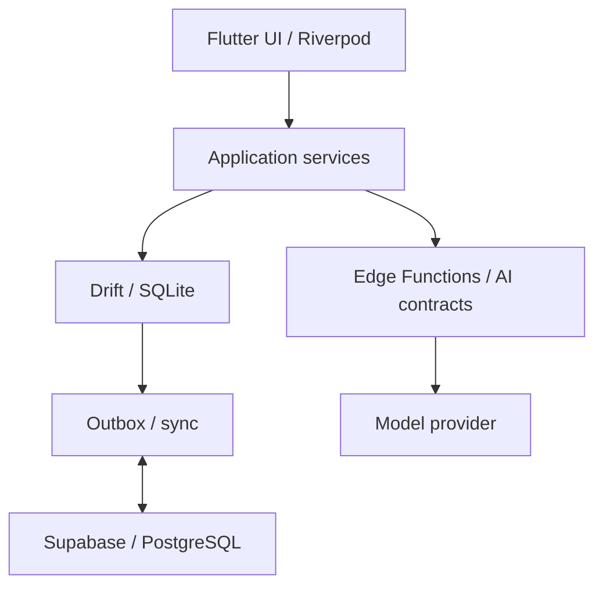

  

<h1 align="center">Level Up · Engineering Case Study</h1>

  <strong>Shipping AI features means owning their failure modes.</strong> 
  A production iOS app, independently designed, built, and shipped by Wassim Akkash.

  <a href="https://apps.apple.com/app/levelup-ai/id6756843363">App Store</a> &nbsp;·&nbsp;
  <a href="https://levelupself.app">Product website</a> &nbsp;·&nbsp;
  <a href="#three-decisions-behind-the-product">Engineering decisions</a> &nbsp;·&nbsp;
  <a href="docs/verification.md">Run the evidence</a>

## What I built

Level Up combines daily planning, training, focus sessions, and AI-assisted review. I took it from product design to App Store release, working across the Flutter client, Supabase backend, local persistence, AI flows, and iOS integrations.

The hard part was making those pieces behave correctly when a model returned an incomplete plan, a stream finished before the UI did, or a local completion came back as a realtime echo.

This case study follows those three problems from **failure → decision → verification**. Production source stays private; the linked public examples use generalized data and simulated external services.

## Three decisions behind the product

### 01 · A shorter response can be a broken response

Failed AI plans led me to shared preflight logic that reduced structured generation to **120 tokens**. That fallback left too little room for a complete plan.

I changed full-plan requests to preserve their required output budget or reject before generation. Validation and one bounded repair handle malformed daily-plan output separately. The key distinction: **budget approval and output validity are different checks**.

The public TypeScript example makes the second boundary inspectable: strict schema checks, at most one repair, typed failures, and one deadline across both calls.

**[Read the investigation](docs/ai-plan-reliability.md)** · [Implementation][pipeline] · [Regression tests][pipeline-tests]

### 02 · Network completion is not UI completion

Chat replies could appear all at once because the final SSE event flushed text still waiting to be revealed. The network was done; the presentation was not.

I changed completion to wait for the reveal queue to drain. Burst-delivery and completion-before-reveal tests pin that ordering. The public SSE lab isolates the same lifecycle alongside byte decoding, interruption, and cancellation.

**[Read the investigation](docs/streaming-lifecycle.md)** · [Implementation][stream] · [Regression tests][stream-tests]

### 03 · A server echo is not a second completion

Focus tracking records work locally, then synchronizes it. A realtime echo must update that state without publishing another completion and counting the same session again.

I used Drift persistence and queued Supabase writes with stable operation IDs, then tested local restoration and simulated echoes. The public sync demo makes a related failure easy to reproduce: **the server commits, the acknowledgement is lost, and the client retries**.

**[Read the investigation](docs/offline-consistency.md)** · [Local store][store] · [Retry worker][worker] · [Regression tests][sync-tests]

## Inspect and run

| Public example | What runs locally |
| :--- | :--- |
| **[LLM structured-output pipeline](https://github.com/wassim991/llm-structured-output-pipeline)** | TypeScript / Deno / Zod. Scripted provider responses exercise validation, repair, deadlines, and cancellation. |
| **[Flutter offline sync demo](https://github.com/wassim991/flutter-offline-sync-demo)** | Real Drift / SQLite persistence, an in-memory simulated backend, and a separate SSE lab with byte-stream fixtures. |

**Verified September 12, 2026:** 26 Deno tests and 17 Flutter tests passed locally. Both linked revisions also have successful GitHub Actions runs. [Commands, revisions, CI results, and limits →](docs/verification.md)

## How the pieces connect

This diagram shows the data and AI paths. RevenueCat / StoreKit billing and optional HealthKit access are separate integrations. Deterministic engines own user-visible scores; the AI supplies review language.

| Area | Stack |
| :--- | :--- |
| Client and data | Flutter, Dart, Riverpod, GoRouter, Drift, SQLite |
| Backend and AI | Supabase Auth, PostgreSQL, Realtime, Edge Functions, LLM integration |
| Integrations and delivery | RevenueCat, StoreKit, HealthKit, Sentry, GitHub Actions, App Store release |

## What this work taught me

A fallback has to preserve what the feature promises. A completion event needs an explicit owner. A successful write and its acknowledgement are separate events. Those distinctions now shape how I design failure paths and choose regression tests.

Built by **[Wassim Akkash](https://github.com/wassim991)** · Software Engineer · AI Systems · Product

[pipeline]: https://github.com/wassim991/llm-structured-output-pipeline/blob/3eccf725b333367cd9539aa980ade9d8d294c7b9/src/pipeline.ts
[pipeline-tests]: https://github.com/wassim991/llm-structured-output-pipeline/blob/3eccf725b333367cd9539aa980ade9d8d294c7b9/tests/pipeline_test.ts
[stream]: https://github.com/wassim991/flutter-offline-sync-demo/blob/30b143d39f8db679cb605e176ed87c17a4dd88bd/lib/streaming/sse.dart
[stream-tests]: https://github.com/wassim991/flutter-offline-sync-demo/blob/30b143d39f8db679cb605e176ed87c17a4dd88bd/test/sse_test.dart
[store]: https://github.com/wassim991/flutter-offline-sync-demo/blob/30b143d39f8db679cb605e176ed87c17a4dd88bd/lib/data/store.dart
[worker]: https://github.com/wassim991/flutter-offline-sync-demo/blob/30b143d39f8db679cb605e176ed87c17a4dd88bd/lib/sync/worker.dart
[sync-tests]: https://github.com/wassim991/flutter-offline-sync-demo/blob/30b143d39f8db679cb605e176ed87c17a4dd88bd/test/sync_test.dart
